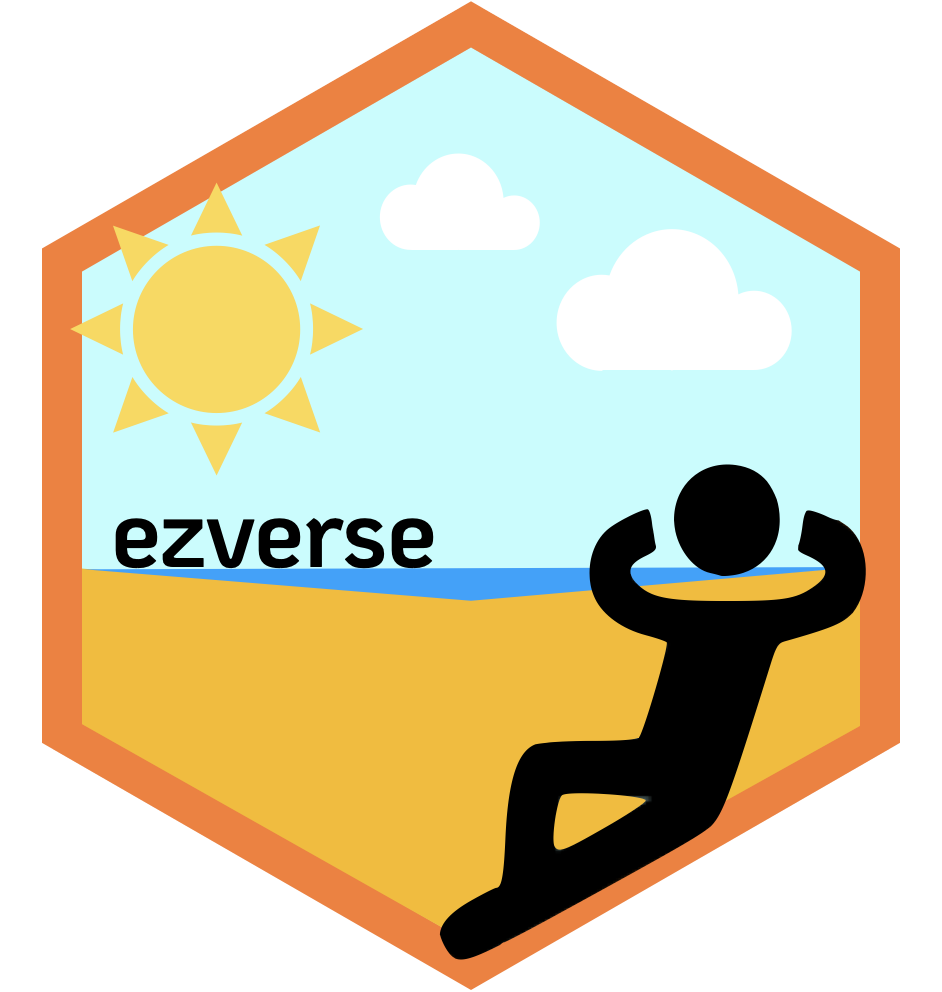

<!-- README.md is generated from README.Rmd. Please edit that file -->

```{r, include = FALSE}
knitr::opts_chunk$set(
  collapse = TRUE,
  comment = "#>",
  fig.path = "man/figures/README-",
  out.width = "100%"
)
```

# ezverse <a href='https://github.com/EricLamphere/ezverse'></a>

<!-- badges: start -->
[](https://lifecycle.r-lib.org/articles/stages.html#experimental)
[](https://github.com/EricLamphere/ezverse/actions/workflows/check-release.yaml)
[](https://CRAN.R-project.org/package=ezverse)
<!-- badges: end -->

The `ezverse` is intended to make various aspects of data science, automated reporting, and data exploration much easier (ez… get it?). Currently, the `ezverse` is comprised of the following packages:

* [**ezxfig**](https://github.com/EricLamphere/ezxfig.git)
* [**ezexplore**](https://github.com/EricLamphere/ezexplore.git)
* [**ezdates**](https://github.com/EricLamphere/ezdates.git)
* [**ezviz**](https://github.com/EricLamphere/ezviz.git)
* [**ezextras**](https://github.com/EricLamphere/ezextras.git)

The goal of *this* package specifically is to mimic much of the `tidyverse` methodology in making it very easy to install and load core packages from the `ezverse`.

## Installation

You can install the development version from [GitHub](https://github.com/EricLamphere/ezverse) with:

``` r
remotes::install_github("EricLamphere/ezverse.git")
```

## Code of Conduct

Please note that the ezverse project is released with a [Contributor Code of Conduct](https://contributor-covenant.org/version/2/0/CODE_OF_CONDUCT.html). By contributing to this project, you agree to abide by its terms.
